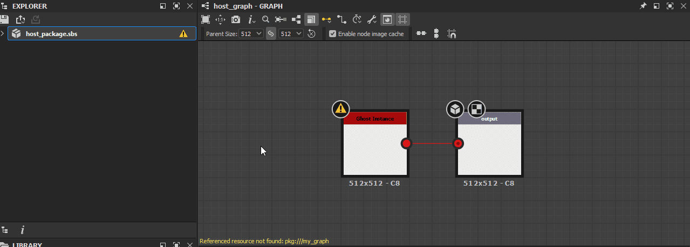
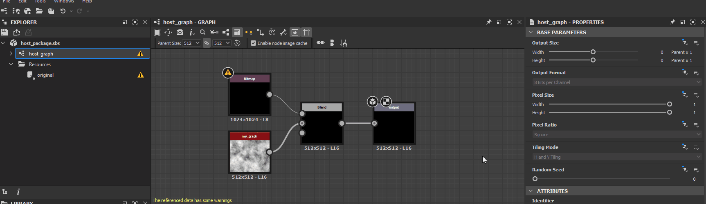
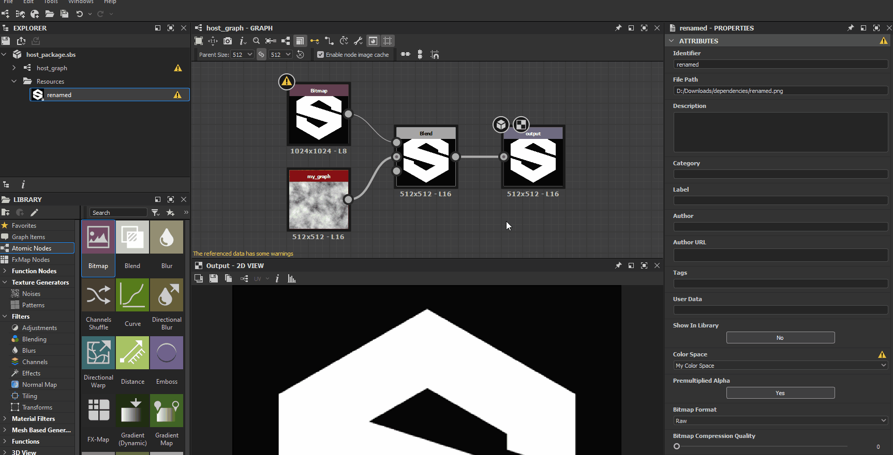

# Avertissements des dépendances

Cette page répertorie les avertissements et les messages d’erreur qui peuvent être déclenchés par des dépendances dans Substance 3D Designer et propose des étapes de dépannage courantes pour chacun d’eux.

Les dépendances sont *d&#39;autres fichiers* référencés par un fichier Substance 3D (SBS). Ils incluent [ressources](../../resources/resources.md) et d&#39;autres fichiers Substance 3D référencés par des nœuds [instance de graphe](../../compositing-graphs/creating-compositing-gra/graph-instances-sub-gra/graph-instances-sub-graphs.md).

##  Pack dépendant non valide

Impossible de charger un package de dépendance, car il est manquant, corrompu ou incompatible avec la version de Designer utilisée.

<b>  Solution</b>

Il existe deux façons principales de corriger ce problème :

1. <b>Chargement de la dépendance réussi</b>

   Vérifiez que le package de dépendance existe à l&#39;emplacement spécifié dans le message d&#39;avertissement. Si ce n’est pas le cas, recherchez le fichier et replacez-le à cet emplacement, ou recréez-le sur place. Si le fichier existe, *essayez de le charger* dans Designer et recherchez les avertissements ou les erreurs liés à ce package. Reportez-vous à la section Étapes de dépannage pour ces problèmes spécifiques et corrigez-les en conséquence.

   Ensuite, rechargez le package hôte en cliquant sur le RMB dessus dans le panneau [Explorateur](../../interface/the-explorer-window/the-explorer-window.md) et en sélectionnant l&#39;option <b>Recharger</b> dans le menu contextuel.

   
1. <b>Redéfinir l&#39;emplacement la dépendance dans le package</b>

   Vous pouvez redéfinir l&#39;emplacement la dépendance à l&#39;aide du [Gestionnaire de dépendances](../../interface/dependency-manager/dependency-manager.md). Cliquez sur RMB sur le package hôte dans le panneau [Explorateur](../../interface/the-explorer-window/the-explorer-window.md) et sélectionnez l&#39;option <b>Gestionnaire de dépendances</b> dans le menu contextuel.

   Recherchez la dépendance manquante dans la liste du gestionnaire de dépendances, cliquez sur RMB dessus et sélectionnez l&#39;option <b>Redéfinir l&#39;emplacement...</b>. Recherchez le package de dépendances à l&#39;aide de la boîte de dialogue du navigateur de fichiers et cliquez sur <b>Ouvrir</b>.

   Ensuite, rechargez le package hôte en cliquant sur le RMB dessus dans le panneau [Explorateur](../../interface/the-explorer-window/the-explorer-window.md) et en sélectionnant l&#39;option <b>Recharger</b> dans le menu contextuel.

   

##  Vérifiez que l&#39;alias *&#39;X&#39;* est défini dans votre projet

L&#39;une des dépendances ou ressources du package est chargée à partir d&#39;un emplacement qui est [alias](../../interface/preferences-window/project-settings/project-settings.md) dans les données du fichier Substance 3D (SBS) sous l&#39;alias indiqué dans l&#39;avertissement, bien que cet alias ne soit pas défini dans les [fichiers de projet](../../interface/preferences-window/project-settings/project-settings.md) actuels.

<b>  Solution</b>

Au moins l&#39;un des [fichiers de projet](../../interface/preferences-window/project-settings/project-settings.md) doit définir l&#39;alias indiqué dans l&#39;avertissement.

##  Impossible de trouver un fichier correspondant à cette ressource

Les fichiers correspondant au *modèle UDIM* pour une [ressource Bitmap](../../resources/bitmap-resource/bitmap-resource.md) sont introuvables.

<b>  Solution</b>

Lorsqu&#39;une ressource [Bitmap](../../resources/bitmap-resource/bitmap-resource.md) est liée et que Designer détecte une *taxonomie de dénomination d&#39;UDIM* dans son nom de fichier, par exemple `0x1` dans `my_texture_0x1.png`, il propose de la lier en tant que *modèle d&#39;UDIM*, de sorte que les nœuds [Bitmap](../../compositing-graphs/nodes-reference-for-com/atomic-nodes/bitmap/bitmap.md) puissent *basculer automatiquement* vers d&#39;autres bitmaps dans un ensemble d&#39;UDIM à l&#39;aide de cette taxonomie, lors de l&#39;utilisation d&#39;un workflow UDIM dans Designer. Dans ce cas, Designer lie la ressource Bitmap d&#39;une *manière différente* qui tient compte du modèle de numérotation UDIM.

Il existe deux façons principales de corriger ce problème :

1. <b>Restaurer les fichiers</b>

   Accédez à l&#39;emplacement spécifié par l&#39;attribut <b>Chemin d&#39;accès</b> de la ressource et vérifiez que les fichiers suivant le modèle existent. Si ce n’est pas le cas, restaurez-les ou recréez-les.

   
1. <b>Redéfinir l&#39;emplacement les fichiers</b>

   Si les fichiers ont été déplacés ou renommés, redéfinissez l&#39;emplacement-les en cliquant sur le RMB de l&#39;élément de ressource dans le panneau [Explorateur](../../interface/the-explorer-window/the-explorer-window.md) et sélectionnez l&#39;option <b>Redéfinir l&#39;emplacement</b> pour lier cette ressource au *premier fichier d&#39;un ensemble* d&#39;images UDIM du même type.

   

##  fichier lié introuvable

Le fichier référencé par une ressource liée n&#39;existe pas à l&#39;emplacement spécifié par son attribut <b>Chemin d&#39;accès</b>.

<b>  Solution</b>

Il existe deux façons principales de corriger ce problème :

1. <b>Restaurer le fichier</b>

   Accédez à l&#39;emplacement spécifié par l&#39;attribut <b>Chemin d&#39;accès</b> de la ressource et vérifiez que le fichier existe. Si ce n’est pas le cas, restaurez-le ou recréez-le.

   
1. <b>Redéfinir l&#39;emplacement le fichier</b>

   Si le fichier a été déplacé ou renommé, redéfinissez l&#39;emplacement-le en cliquant sur le RMB de l&#39;élément de ressource dans le panneau [Explorateur](../../interface/the-explorer-window/the-explorer-window.md) et sélectionnez l&#39;option <b>Redéfinir l&#39;emplacement</b> pour lier cette ressource à un autre fichier du même type.

   

##  espace colorimétrique introuvable

Une ressource [Bitmap](../../resources/bitmap-resource/bitmap-resource.md) référence un espace colorimétrique introuvable dans l&#39;[environnement de gestion des couleurs](../../color-management/color-management.md) actuel. Il peut s’agir d’un profil ICC ou d’un espace colorimétrique dans une configuration OCIO.

<b>  Solution</b>

La liste des options de l’attribut d’espace colorimétrique est automatiquement renseignée avec l’espace colorimétrique valide disponible. Remplacez la valeur d’espace colorimétrique de cette ressource par toute autre entrée de la liste.

Vous pouvez également ajouter cet espace colorimétrique à l&#39;environnement actuel de [gestion des couleurs](../../color-management/color-management.md), puis redémarrer Designer. Il peut s’agir d’un profil ICC ou d’un espace colorimétrique dans une configuration OCIO.

>[!NOTE]
>
> Cet avertissement est déclenché uniquement lors de l&#39;utilisation d&#39;un mode de gestion des couleurs autre que **Hérité** (qui s&#39;apparente à la désactivation de la gestion des couleurs). Vous pouvez activer la gestion des couleurs dans la section **Gestion des couleurs** des [paramètres du projet](../../interface/preferences-window/project-settings/project-settings.md).

## Ressource de référence  introuvable

Le graphe attribué à l&#39;UV d&#39;une [ressource Scène 3D](../3d-scene-resource/3d-scene-resource.md) est introuvable à l&#39;emplacement indiqué dans l&#39;avertissement.

<b>  Solution</b>

Il existe deux façons principales de corriger ce problème :

1. <b>Restaurer le graphe</b>

   Vérifiez le contenu du package dans le panneau [Explorateur](../../interface/the-explorer-window/the-explorer-window.md) pour le graphe spécifié dans la liste <b>Tuiles UV</b>. S’il n’existe pas, restaurez-le ou recréez-le.

   
1. <b>Sélectionner un autre graphe</b>

   Attribuez un autre graphe du package à l’UV.

   

##  UV sont attribués plusieurs fois

Un UV pour une [ressource Scène 3D](../3d-scene-resource/3d-scene-resource.md) est affecté plusieurs fois à un [graphe Substance](../../compositing-graphs/substance-compositing-graphs.md).

<b>  Solution</b>

Pour chaque Ensemble d&#39;UV d&#39;une ressource Maillage 3D, assurez-vous qu&#39;aucun index UDIM n&#39;est présent *plusieurs fois* dans la liste <b>Tuiles UV</b>.

##  UV non valides

Un UV répertorié pour une [ressource Scène 3D](../3d-scene-resource/3d-scene-resource.md) n&#39;est pas défini dans le maillage ou est endommagé.

<b>  Solution</b>

Pour chaque Ensemble d&#39;UV d&#39;une ressource Maillage 3D, assurez-vous que tous les éléments de la liste <b>Tuiles UV</b> font référence à des UDIM qui *existent* dans la ressource liée.

>[!NOTE]
>
> Cet avertissement ne peut pas être déclenché via l&#39;interface utilisateur, car il *répertorie uniquement* les UDIM détectés dans la ressource liée. Seule la modification directe des données dans le fichier Substance 3D (SBS) *directement* peut déclencher cet avertissement.

