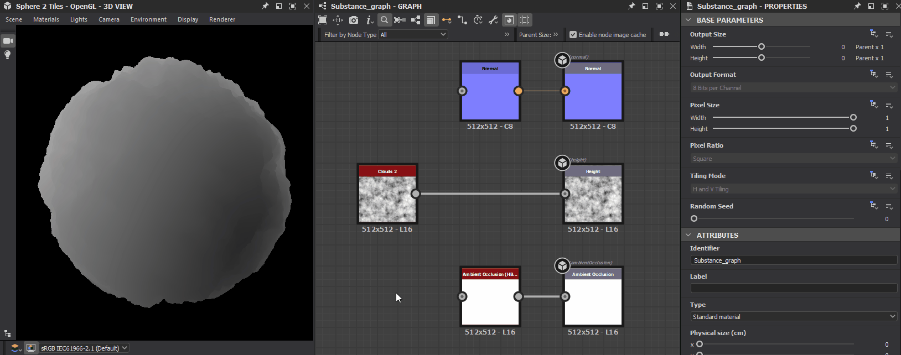

# Problèmes liés à la vue 3D

Cette page répertorie les problèmes techniques liés à la [vue 3D](../../interface/3d-view/3d-view.md) dans Substance 3D Designer et propose des étapes de dépannage pour chacun d&#39;eux.

## Basse performance : le GPU discret n’est pas utilisé

** Problème**

Substance 3D Designer n&#39;utilise pas le GPU *discret* (<b>dGPU</b>) du système et utilise le GPU *intégré* (<b>iGPU</b>) à la place. Cela entraîne de faibles performances lors du rendu des graphiques et/ou de la [vue 3D](../../interface/3d-view/3d-view.md).

** Étapes recommandées**

Les systèmes avec graphiques commutables peuvent *forcer le dGPU* qui doit être utilisé pour une *application spécifique* dans un logiciel dédié, selon le fabricant du GPU.

Par exemple, les utilisateurs disposant d&#39;un <b>dGPU Nvidia</b> peuvent effectuer les opérations suivantes :

1. Fermer Substance 3D Designer
2. Ouvrez le <b>Panneau de configuration NVIDIA</b>
3. Accédez à l&#39;écran <b>Gérer les paramètres 3D</b> dans la section <b>Paramètres 3D</b>
4. Recherchez « Substance 3D Designer » dans l&#39;onglet <b>Paramètres du programme</b>
5. Sélectionnez <b>Processeur NVIDIA hautes performances</b> dans la liste déroulante <b>GPU préféré</b>
6. Démarrer Substance 3D Designer

>[!WARNING]
>
> Veuillez noter que les GPU intégrés (iGPU) ne sont *pas pris en charge*. Pour en savoir plus, consultez la page [Configuration requise](../../getting-started/system-requirements/system-requirements.md).

## L’objet 3D est plat

** Problème**

Un objet 3D qui présentait des volumes détaillés dans une session devient plat dans la session suivante, mais le graphe n’a pas changé et la Map height contient les mêmes données.

** Étapes recommandées**

L&#39;effet de déformation d&#39;un objet 3D selon une Map height est effectué à l&#39;aide d&#39;une technique appelée **displacement de Tessellation**. Cette technique comporte deux étapes:

1. **Tessellation** : la géométrie de l&#39;objet est *subdivisée* en vertex, ce qui donne une *géométrie plus dense* pour prendre en charge des détails de volume plus fins
2. **Displacement** : les vertex sont *déplacés*, c&#39;est-à-dire déplacés, le long de leur *vecteur normal*. Le vecteur normal suit la direction vers laquelle se trouve un polygone et a une magnitude (longueur) de 1

La direction *du displacement* est connue : la direction du vecteur normal.\
Le displacement *distance* de déplacement des vertex est calculé comme suit : `Distance = Height scale * Height map`. Comme la Map height n&#39;a *pas changé* dans le graphe, cela laisse l&#39;**échelle d&#39;Height**.

La valeur d&#39;échelle d&#39;Height par défaut est **1.0**, ce qui peut entraîner un effet de displacement qui n&#39;est *pas perceptible* en fonction du maillage affiché dans la vue 3D et de la Map height qui lui est appliquée.

Cette valeur peut être modifiée de l’une des manières suivantes :

| Dans la vue 3D | Dans la Vue du graphe |
|:--------------------------------------------------------------------------------------------------------------------------------------------------|:-----------------------------------------------------------------------------------------------------------------------------------------------------------------------------------------------------------------------------------------------------------------------------------------------------------------------------------------------------------------------------------------|
| Utilisez la **fenêtre contextuelle Displacement** dans la barre d&#39;outils de gauche.<br>En savoir plus sur la [page dédiée](../../interface/3d-view/displacement/displacement.md). | Créez un nœud [Output](../../compositing-graphs/nodes-reference-for-com/atomic-nodes/output/output.md) et définissez l&#39;utilisation `heightScale` dans ses propriétés.<br>Fournissez une valeur à cette sortie avec une valeur, en utilisant un [nœud de Flottant constant](../../compositing-graphs/nodes-reference-for-com/node-library/values/constant.md#floats) par exemple, puis *réappliquez le graphe* dans la vue 3D. |

>[!TIP]
>
> À l&#39;aide de cette méthode, vous pouvez définir une valeur d&#39;échelle d&#39;Height personnalisée *par graphe*, qui vous permet de l&#39;ajuster pour qu&#39;elle corresponde au matériau spécifique de ce graphe.

## La vue 3D est entièrement noire

** Problème**

Dans les versions 15.0.0 et ultérieures, le viewport de la vue 3D est noir et plat. Je vois des incrustations de texte (par exemple, des échantillons et le temps de rendu), mais la Scène 3D n’est pas visible.

** Étapes recommandées**

Versions 15.1 et ultérieures

Les nouveaux rendus 3D ont été mis à niveau dans la version 15.1 et nécessitent des pilotes GPU récents. Mettez à jour les pilotes GPU de votre système vers la dernière version.

Vous trouverez peut-être des pilotes ici : [NVIDIA](https://www.nvidia.com/Download/index.aspx?lang=en-us)  | [AMD](https://www.amd.com/en/support)  | [Intel](https://downloadcenter.intel.com/product/80939/Graphics-Drivers)

Versions 15.0 et ultérieures

Designer [15.0.0](../../release-notes/version-15-0/version-15-0.md) a introduit nos nouveaux [rendus 3D](../../interface/3d-view/3d-renderers/3d-renderers.md) internes, qui utilisent des technologies modernes et ne sont donc pas pris en charge par les GPU plus anciens.

Les GPU pris en charge incluent la série NVIDIA RTX 20 (Turing) ou une version ultérieure, conformément à la [configuration requise](../../getting-started/system-requirements/system-requirements.md) de Designer.

Vous pouvez continuer à utiliser le moteur de rendu OpenGL par défaut, en utilisant la [nouvelle option dans les paramètres du projet](../../interface/preferences-window/project-settings/project-settings.md) :

1. Accédez à Modifier > Préférences > Projets
2. Sélectionnez le dernier fichier de projet dans la liste
3. Sous la liste des fichiers de projet, sélectionnez l’onglet Vue 3D
4. Définissez l’option « Rendu par défaut » sur « OpenGL (obsolète) »
5. Cliquez sur OK pour valider les modifications

Désormais, toutes les nouvelles vues 3D utilisent le rendu OpenGL par défaut, ce qui vous permet de continuer à travailler comme auparavant.

>[!NOTE]
>
> Les mêmes étapes de problème et de dépannage s&#39;appliquent à la plupart des GPU AMD et Intel, qui ne sont actuellement *pas pris en charge* par nos nouveaux systèmes de rendu 3D.

>[!IMPORTANT]
>
> Le moteur de rendu OpenGL est *obsolète* et peut être supprimé de Designer à l&#39;avenir. Nous vous recommandons de mettre à niveau le GPU du système pour éviter toute interruption de votre workflow et assurer une prise en charge continue.

## Le message « Moteur de rendu non pris en charge » s’affiche

** Problème**

Dans les versions 15.0.0 et ultérieures, le message « Moteur de rendu non pris en charge » s’affiche dans le coin inférieur droit de la fenêtre lors de l’utilisation des nouveaux rendus 3D (Pixellisation, Tracé GPU). La scène 3D n’est pas visible.

** Étapes recommandées**

Designer [15.0.0](../../release-notes/version-15-0/version-15-0.md) a introduit nos nouveaux [rendus 3D](../../interface/3d-view/3d-renderers/3d-renderers.md) internes, qui utilisent des technologies modernes et ne sont donc pas pris en charge par les GPU plus anciens.

Les GPU pris en charge incluent la série NVIDIA RTX 20 (Turing) ou une version ultérieure, conformément à la [configuration requise](../../getting-started/system-requirements/system-requirements.md) de Designer.

Dans les paramètres par défaut, la vue 3D revient automatiquement au moteur de rendu OpenGL, si l&#39;option « Rendu par défaut » est définie sur « Par défaut (rendu prédéfini) » dans les [paramètres du projet](../../interface/preferences-window/project-settings/project-settings.md).

Vous pouvez rechercher et ajuster cette option en procédant comme suit :

1. Accédez à Modifier > Préférences > Projets
2. Sélectionnez le dernier fichier de projet dans la liste
3. Sous la liste des fichiers de projet, sélectionnez l’onglet Vue 3D
4. L’option Rendu par défaut est répertoriée dans les paramètres de l’onglet

>[!NOTE]
>
> Seuls les GPU de la <b>série NVIDIA GTX</b> peuvent actuellement être détectés comme non pris en charge.
> 
> Cependant, la plupart des GPU AMD et Intel ne sont pas non plus pris en charge et produiront un rendu noir sans message. Reportez-vous à l’élément « La vue 3D est entièrement noire » ci-dessus pour obtenir des conseils sur ces GPU.

>[!IMPORTANT]
>
> Le moteur de rendu OpenGL est *obsolète* et peut être supprimé de Designer à l&#39;avenir. Nous vous recommandons de mettre à niveau le GPU du système pour éviter toute interruption de votre workflow et assurer une prise en charge continue.

## L’objet 3D a l’air entièrement lisse

** Problème**

Après avoir travaillé sur les données envoyées à l&#39;**Height** [sortie](../../compositing-graphs/nodes-reference-for-com/atomic-nodes/output/output.md), l&#39;objet semble avoir un certain volume, mais *semble tout à fait fluide*, comme si les informations d&#39;height étaient ignorées dans l&#39;ombrage.

<table style="margin-left: 0; margin-right: 0;">
<tr style="border: 0;">
<td style="border: 0; width: 60%; vertical-align: top">

** Étapes recommandées**

Assurez-vous que les données d&#39;height sont *converties en normales* qui sont connectées à la **sortie normale** [sortie](../../compositing-graphs/nodes-reference-for-com/atomic-nodes/output/output.md).

Lors de l&#39;utilisation de la technique du **Displacement de facettisation** (voir « L&#39;objet 3D est plat » ci-dessus), les objets peuvent *se déformer* pour suivre les données d&#39;height, mais leur surface *ne réagira pas différemment à la lumière* jusqu&#39;à ce que ses *normales* soient également modifiées pour tenir compte des données d&#39;height.

La solution est assez simple : connectez le dernier nœud du flux menant à la sortie Height à un nœud [Normal](../../compositing-graphs/nodes-reference-for-com/atomic-nodes/normal/normal.md). Ajustez le paramètre **Intensité** de ce nœud en fonction du matériau sur lequel vous travaillez et connectez le nœud Normal à la sortie **Normal**.

</td>
<td style="border: 0; width: 40%; vertical-align: top">

{width="256px"}

</td>
</tr>
</table>

## Le rendu est flou/pixellisé

** Problème**

L&#39;image rendue semble floue ou pixellisée lorsque le système utilise la *mise à l&#39;échelle de l&#39;affichage*.

<table style="margin-left: 0; margin-right: 0;">
<tr style="border: 0;">
<td style="border: 0; width: 60%; vertical-align: top">

** Étapes recommandées**

Par défaut, Designer utilise la résolution d&#39;affichage *mise à l&#39;échelle* pour définir la résolution de rendu de la [vue 3D](../../interface/3d-view/3d-view.md). Vous pouvez modifier ce paramètre afin que la résolution d&#39;affichage *native* soit utilisée à la place pour un rendu précis.

Ouvrez le menu **Modifier** et sélectionnez l&#39;option **Préférences...**. Dans la fenêtre [Préférences](../../interface/preferences-window/preferences-window.md), ouvrez la section **Vue 3D** et définissez le paramètre **Mise à l&#39;échelle de l&#39;aire d&#39;affichage** sur *Aucun*.

</td>
<td style="border: 0; width: 40%; vertical-align: top">

{width="256px"}

</td>
</tr>
</table>

## Je ne trouve pas la propriété « Facteur de facettisation »

** Problème**

Après la mise à niveau de Designer vers la version 15.0.0, je ne trouve plus le paramètre « Facteur de facettisation » dans les propriétés du matériau où il se trouvait auparavant.

** Étapes recommandées**

Lors de l’utilisation des nouveaux systèmes de rendu (Pixellisation et Pathtracer GPU), le « facteur de facettisation » se trouve dans les propriétés de ces systèmes de rendu. Dans la vue 3D, accédez à <b>Rendu > Modifier les paramètres</b>. La propriété sera répertoriée dans le dock Propriétés.

>[!NOTE]
>
> L’étendue de la facettisation varie en fonction du moteur de rendu :
> 
> * Pixellisation/Pathtracer GPU : une valeur unique appliquée globalement à l’ensemble de la scène.
> * OpenGL : une valeur par matière.
> * Iray : une valeur par maille.

## Les objets 3D ne semblent pas corrects : leur ombrage ne convient pas à l’éclairage

** Problème**

L’ombrage des objets repose sur leurs vecteurs normaux, tangents et binormaux. Leurs coordonnées utilisent la plage `[-1, 1]`, tandis que les maps normal utilisent la plage `[0, 1]` dans la plupart des cas. Pour adapter les valeurs de l&#39;une à l&#39;autre, un <b>biais et une échelle</b> doivent être appliqués : `value * scale + bias`.

Par exemple, une échelle de 2 et un biais de -1 adaptent la valeur x de `[0, 1]` à `[-1, 1]` de sorte que : `x * 2 - 1`.

Designer n’applique pas d’échelle ni de biais normaux, sauf s’ils sont spécifiés par un Maillage 3D. Si ces informations sont manquantes, un avertissement s&#39;affiche dans la console lorsque [l&#39;un de ses matériaux](../../working-with-3d-scenes/overriding-scene-mat/overriding-scene-materials.md) est remplacé :

```
[SceneGraph]No 'scale' or 'bias' defined on the UsdUVTexture shader '/root/material/<materialName>' (the rendering may be incorrect)
```


** Étapes recommandées**

Pour les scènes exportées aux formats USD il y a un certain temps : réexportez la scène en utilisant une version récente de USD, qui inclut les données nécessaires. Faites attention aux propriétés liées à l’échelle normale et au biais, le cas échéant, qui dépendent du logiciel utilisé pour exporter la scène.

Lorsque [remplace une matière](../../working-with-3d-scenes/overriding-scene-mat/overriding-scene-materials.md), Designer traite le maillage et calcule toutes les données manquantes relatives à ses normales, tangentes et binormales. Si l’échelle et le biais par défaut de Designer correspondent à ceux requis pour le maillage, le maillage semblera correct lors du remplacement.

## Blocage lors du démarrage de la vue 3D

** Problème**

Designer se bloque au démarrage de la vue 3D, lors de la création d’un projet, du chargement d’un projet ou du démarrage manuel d’une vue 3D.

** Étapes recommandées**

Tout d&#39;abord, assurez-vous que votre système est conforme à la [configuration requise](../../getting-started/system-requirements/system-requirements.md) de Designer.

Mettez ensuite à jour vos pilotes graphiques. Vous pouvez trouver les derniers pilotes pour votre GPU en suivant ces liens : [NVIDIA](https://www.nvidia.com/Download/index.aspx?lang=en-us)  | [AMD](https://www.amd.com/en/support)  | [Intel](https://downloadcenter.intel.com/product/80939/Graphics-Drivers)

Si votre système comprend à la fois un GPU intégré (iGPU) et un GPU distinct (dGPU), assurez-vous de *mettre à jour les pilotes pour les deux* !

Désactivez ensuite tout logiciel susceptible d’injecter ou de superposer des données dans un processus graphique 3D. Voici quelques exemples :

* Injecteurs de post-traitement tels que ReShade
* Incrustations telles que les réticules personnalisés ou les mesures de performances GPU
* Logiciel de capture d’écran pour enregistrer, diffuser ou partager des graphiques 3D en temps réel
