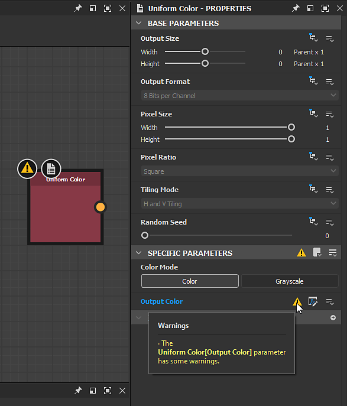
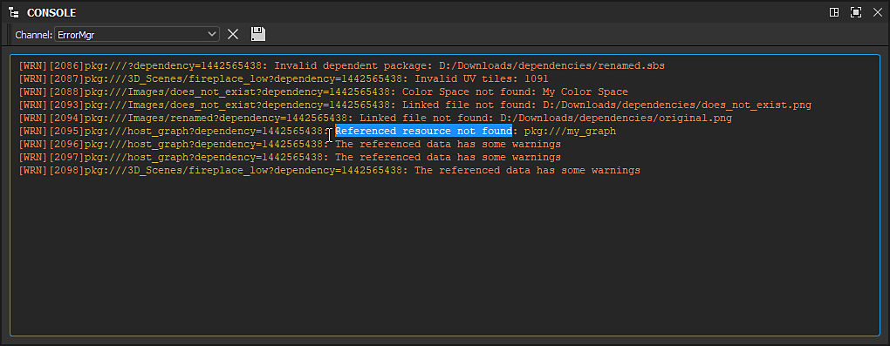

# Avertissements et erreurs

Cette page explique le signalement des avertissements et des messages d&#39;erreur qui peuvent apparaître dans [Substance 3D Designer](https://www.adobe.com/fr/products/substance3d-designer.html), ainsi que des liens vers la résolution des problèmes liés aux avertissements en fonction de leur source.

## Vue d’ensemble

Lorsque vous travaillez sur des projets dans Designer, vous pouvez rencontrer des avertissements et des messages d’erreur, qui vous informent d’un problème dans le projet :

* Les **avertissements** s&#39;affichent dans du texte *jaune* et attirent votre attention sur un problème qui peut entraîner un résultat indésirable en raison d&#39;un manque de saisie ou d&#39;une configuration incorrecte. Ils ne *bloquent généralement pas* votre travail.
* Les **erreurs** s&#39;affichent dans le texte *rouge* et indiquent un échec de calcul, un résultat inattendu ou l&#39;incapacité d&#39;effectuer une tâche. Ils *bloquent* généralement votre travail.

En général, les avertissements et les erreurs sont affichés sur l&#39;élément qui les a déclenchés et *sont apparus sur chaque parent* de cet élément. Voici une liste des endroits courants où les avertissements et les erreurs sont signalés :

<table>
<tr style="border: 0;">
<td width="58.30%" style="border: 0;" valign="top">

### Explorateur

Pour tout élément du panneau [Explorateur](../../interface/the-explorer-window/the-explorer-window.md) qui présente un avertissement, celui-ci s&#39;affiche avec une icône  sur le bord le plus à droite de l&#39;entrée de l&#39;élément dans la liste. Laissez le curseur sur cette icône pendant quelques secondes pour afficher une *info-bulle* répertoriant tous les avertissements en détail.

Ils suivent les règles suivantes :

* Si l’élément est imbriqué dans un autre élément (par exemple, un dossier), des avertissements lui sont appliqués s’il est réduit.
* Les listes d&#39;avertissements sont *cumulatives*, dans la mesure où elles représentent la somme des avertissements d&#39;un élément *et* de tous les avertissements de ses enfants qui sont apparus.
* Tous les avertissements signalés par le contenu d&#39;un package sont appliqués à l&#39;élément *package* et ajoutés aux *propres* avertissements du package.

</td>
<td width="41.60%" style="border: 0;" valign="top">

{width="256px"}

</td>
</tr>
</table>

<table>
<tr style="border: 0;">
<td width="58.30%" style="border: 0;" valign="top">

### Vue Graphique

Pour tout élément du panneau [Vue graphique](../../interface/the-graph-view/the-graph-view.md) qui affiche un avertissement, celui-ci s&#39;affiche avec un texte coloré dans le *coin inférieur gauche* de la fenêtre d&#39;affichage. Si l&#39;avertissement est déclenché par un nœud spécifique, ce nœud aura un badge d&#39;avertissement . Laissez le curseur sur ce badge pendant quelques secondes pour afficher une *info-bulle* répertoriant tous les avertissements en détail.

Ils suivent les règles suivantes :

* Si un graphique source *instancié* dans un autre graphique hôte comporte un ou plusieurs avertissements, le [nœud d&#39;instance](../../compositing-graphs/creating-compositing-gra/graph-instances-sub-gra/graph-instances-sub-graphs.md) de ce graphique source affichera un avertissement *unique* `The referenced data has some warnings`.
* Les listes d&#39;avertissements sont *cumulatives*, dans la mesure où elles représentent la somme des avertissements du graphique *et* de tous les avertissements de ses nœuds enfants.
* Tous les avertissements d’un graphique sont signalés sur l’élément représentant ce graphique dans le panneau Explorateur.

</td>
<td width="41.60%" style="border: 0;" valign="top">

{width="256px"}

</td>
</tr>
</table>

<table>
<tr style="border: 0;">
<td width="58.30%" style="border: 0;" valign="top">

### Propriétés

Pour tout élément du panneau [Propriétés](../../interface/properties/properties.md) qui présente un avertissement, celui-ci s&#39;affiche avec une icône  sur le bord le plus à droite de l&#39;entrée de l&#39;élément dans la liste. Laissez le curseur sur cette icône pendant quelques secondes pour afficher une *info-bulle* répertoriant tous les avertissements en détail.

Ils suivent les règles suivantes :

* Si l’élément est imbriqué sous un autre élément (par exemple, un en-tête de section), des avertissements lui sont appliqués s’il est réduit.
* Les listes d&#39;avertissements sont *cumulatives*, dans la mesure où elles représentent la somme des avertissements d&#39;un élément *et* de tous les avertissements de ses enfants qui sont apparus.
* Si le [graphique de fonction](../../function-graphs/function-graphs.md) appliqué à un [paramètre d&#39;entrée](../../compositing-graphs/manage-parameters/exposing-a-parameter/exposing-a-parameter.md) comporte un ou plusieurs avertissements, l&#39;élément de paramètre aura un avertissement *unique* `The [x] parameter's function has some warnings`.

</td>
<td width="41.60%" style="border: 0;" valign="top">

{width="256px"}

</td>
</tr>
</table>

<table>
<tr style="border: 0;">
<td width="58.30%" style="border: 0;" valign="top">

### Console

Les avertissements et les erreurs sont signalés dans le panneau **Console**, auquel vous pouvez accéder via le menu **Windows** dans le [menu principal](../../interface/the-main-toolbar/the-main-toolbar.md). Vous pouvez isoler les avertissements et les erreurs du reste des entrées de la console en définissant le paramètre **Canal** sur `ErrorMgr`.

>[!NOTE]
>
> Comme tout le texte de la console est *sélectionnable*, vous pouvez utiliser ce panneau pour *copier facilement les avertissements et les messages d&#39;erreur* et les coller dans l&#39;outil **Recherche locale** de cette documentation ou dans n&#39;importe quel moteur de recherche Internet. Cela accélère la recherche de conseils pour le dépannage des problèmes.

</td>
<td width="41.60%" style="border: 0;" valign="top">

{width="256px"}

</td>
</tr>
</table>

### Messages avec « (# fois) »

Dans le cas où l&#39;avertissement ou l&#39;erreur *identique* est déclenché *plusieurs fois* sur un élément *et* sur l&#39;un de ses enfants, ces avertissements seront *fusionnés en un* et le suffixe `(# times)` s&#39;affichera, vous informant du nombre de fois où cet avertissement ou cette erreur a été signalé.

## Catégories

Voici une liste des avertissements et des erreurs que vous pouvez rencontrer dans Designer, triés en fonction de leur source. Les titres de catégorie renvoient à leur page dédiée qui propose des explications et des guides de dépannage pour résoudre chaque problème.

<table>
<tr style="border: 0;">
<td style="border: 0;" valign="top">

### Avertissements dans les graphes Substance

* Aucun nœud de sortie défini
* La fonction du paramètre [x] comporte des avertissements
* Les données référencées comportent des avertissements
* Ressource de référence introuvable
* Le nœud de texte utilise une police non valide

</td>
<td style="border: 0;" valign="top">

### Avertissements dans les graphiques de fonctions

* Aucun nœud de sortie défini
* Le nœud de sortie actuel renvoie une valeur de type x
* Certains nœuds Get n&#39;ont pas de nom de variable
* Certains nœuds Set n&#39;ont pas de nom de variable

</td>
</tr>
</table>

### Avertissements des dépendances

* Pack dépendant non valide
* Vérifiez que l’alias « x » est défini dans votre projet.
* Impossible de trouver un fichier correspondant à cette ressource
* Fichier lié introuvable
* Espace colorimétrique introuvable
* Ressource de référence introuvable
* Les tuiles UV sont attribuées plusieurs fois
* Carreaux UV non valides
