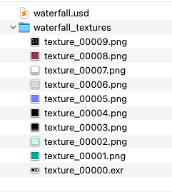
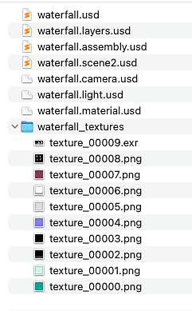

# Exportation de séquences

Lorsque vous devez exporter la scène avec toutes les modifications effectuées dans Designer, utilisez les actions « Exporter la scène... » dans le menu Scène de la [Vue 3D](../../interface/3d-view/3d-view.md).

Pour les exportations aux formats USD, le contenu de la scène correspondra à l&#39;arborescence affichée dans le [navigateur de scènes](../../interface/3d-view/scene-browser/scene-browser.md).

Pour les autres formats, le contenu de la scène et sa structure interne dépendent des fonctions prises en charge par le format de fichier sélectionné.

>[!NOTE]
>
> Tous les éléments ajoutés à la scène par Designer seront inclus dans la scène exportée : la caméra par défaut, l’environnement par défaut, toutes les matières copient les lumières supplémentaires.

{zoomable="yes"}

<table>
<tr style="border: 0;">
<td style="border: 0;" valign="top">

## Exporter la scène

</td>
<td style="border: 0;" valign="top">

### Exporter la scène sous forme de calques

</td>
<td style="border: 0;" valign="top">

### Textures

</td>
</tr>
</table>

## Exporter la scène

<table>
<tr style="border: 0;">
<td style="border: 0;" valign="top">

L’action « Exporter la scène... » du menu « Scène » exporte les scènes 3D modifiées de manière destructive : la scène est *aplatie* et toute référence à l’original est perdue.

Cela signifie que les modifications apportées à la scène d’origine n’ont aucune incidence sur la scène exportée.

</td>
<td style="border: 0;" valign="top">

{zoomable="yes"}

</td>
</tr>
</table>

## Exporter la scène sous forme de calques

<table>
<tr style="border: 0;">
<td style="border: 0;" valign="top">

L&#39;action « Exporter la scène sous forme de calques... » est exportée aux formats <b>USD</b> (.usd, .usda, .usdc, .usdz) et est *non destructive* : le fichier exporté principal dirige une *chaîne de références* où tous les aspects modifiés de la nouvelle scène sont stockés dans des fichiers USD distincts.

Cela signifie que les modifications apportées à la scène d’origine sont reportées sur la scène exportée.

</td>
<td style="border: 0;" valign="top">

{zoomable="yes"}

</td>
</tr>
</table>

Les fichiers exportés suivent cette structure :

* <b>Fichier principal</b>
  * <b>.layers</b> : référence les sous-calques ci-dessous et déclare les remplacements de matériau, qui lient la géométrie aux copies de matériau créées par Designer.
    * <b>.assembly</b> : référence le fichier .scene# et déclare les remplacements de géométrie, qui apportent les données recalculées par Designer de la géométrie affectée par les matériaux remplacés.
      * <b>.scene#</b> : fait référence à la scène originale.
    * <b>.camera</b> : déclare la caméra ajoutée par Designer à la scène.
    * <b>.light</b> : déclare les éclairages ajoutés par Designer à la scène.
    * <b>.material</b> : déclare les copies de matières ajoutées par Designer à la scène, qui utilisent les textures exportées.

## Textures

Les textures sont exportées dans un répertoire en regard du fichier exporté et portent son nom, avec un suffixe « <b>\_textures</b> ».

Ils utilisent le format <b>PNG</b>, à l’exception des textures HDR (virgule flottante) qui utilisent le format <b>EXR</b>.
