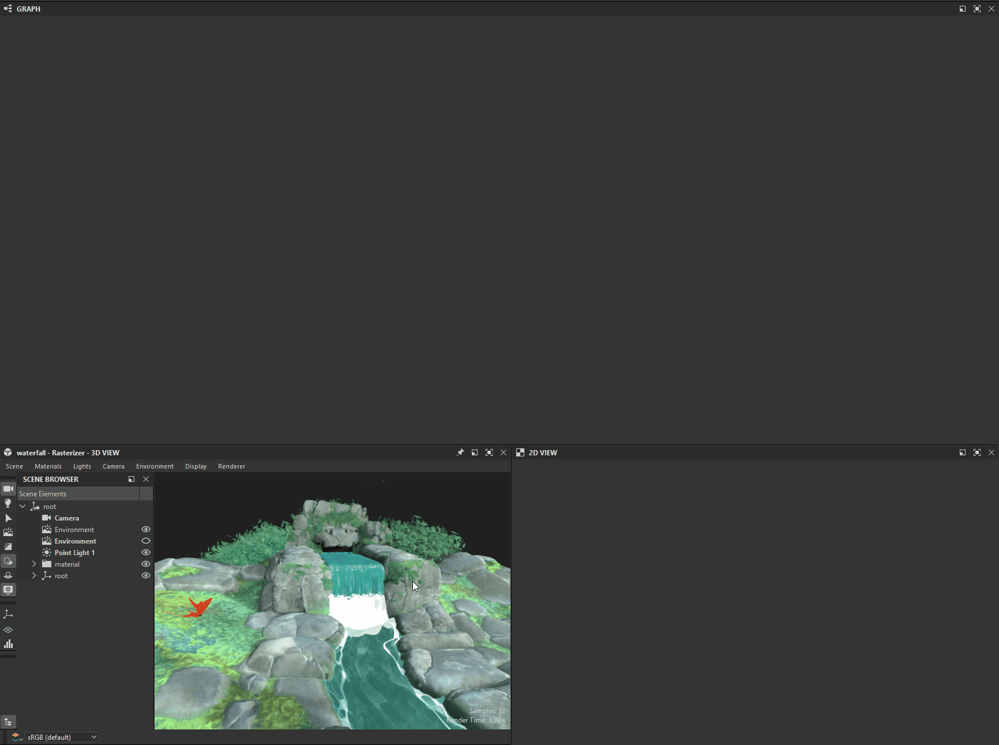
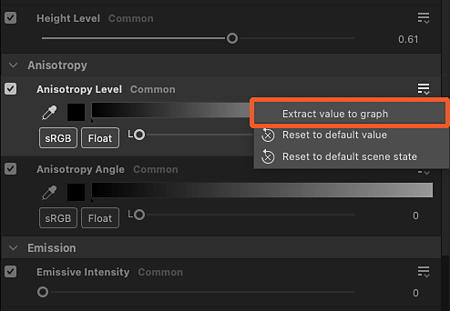

# Extraction des valeurs et des textures des matériaux

Les propriétés des matériaux peuvent être extraites pour être utilisées dans des graphiques de Substance.

<table>
<tr style="border: 0;">
<td style="border: 0;" valign="top">

## Nouveau graphique à partir de textures

</td>
<td style="border: 0;" valign="top">

### Extraction d’une texture

</td>
<td style="border: 0;" valign="top">

### Extraire une valeur

</td>
</tr>
</table>

## Nouveau graphique à partir de textures

L’action Créer un graphique à partir des entrées de texture permet de créer un graphique de Substance avec toutes les textures utilisées par un matériau

Voici quelques opérations qui peuvent se produire lorsque vous utilisez cette action :

* Un graphique de Substance portant le nom de la matière est créé à l’emplacement sélectionné.
* Une [ressource bitmap](../../resources/bitmap-resource/bitmap-resource.md) est créée pour chaque texture utilisée par le matériau et placée dans un dossier nommé d&#39;après le matériau, sous un dossier « Ressources ».
* Dans le graphique, des nœuds [Bitmap](../../compositing-graphs/nodes-reference-for-com/atomic-nodes/bitmap/bitmap.md) sont créés pour chacune de ces ressources bitmap et automatiquement connectés aux nœuds [Output](../../compositing-graphs/nodes-reference-for-com/atomic-nodes/output/output.md) configurés après les propriétés de matériau à l&#39;aide de textures.
* Si chaque couche d&#39;une même texture est utilisée pour piloter différentes propriétés de matériau (cette technique est appelée [packing de couche](../../glossary/glossary.md)), des nœuds de [conversion des niveaux de gris](../../compositing-graphs/nodes-reference-for-com/atomic-nodes/grayscale-conversion/grayscale-conversion.md) sont automatiquement ajoutés pour sélectionner les couches appropriées.
* Le graphique est automatiquement connecté au matériau et son aspect ne doit pas changer tant que vous n’avez pas effectué de modifications sur le graphique.

<table>
<tr style="border: 0;">
<td style="border: 0;" valign="top">

{zoomable="yes"}

*Action dans la fenêtre d’affichage de la vue 3D*

</td>
<td style="border: 0;" valign="top">

{zoomable="yes"}

*Action dans le menu Matières*

</td>
<td style="border: 0;" valign="top">

{zoomable="yes"}

*Action dans le dock des propriétés*

</td>
</tr>
</table>

{zoomable="yes"}

*Résultat de la création du graphique à partir des textures matérielles*

+++Démonstration
{zoomable="yes"}

+++

>[!TIP]
>
> Vous pouvez accéder rapidement et directement à l&#39;action dans la fenêtre Vue 3D en plaçant le curseur sur l&#39;objet et en appuyant sur <b>Maj+LMB</b> pour le sélectionner. puis en cliquant sur RMB pour accéder à un menu contextuel hébergeant l’action.

>[!NOTE]
>
> Pour les formats utilisant des *textures incorporées* (par exemple : USDZ), les textures doivent être extraites et copiées sur le disque. Il en résulte une étape supplémentaire pour sélectionner l’emplacement vers lequel les textures doivent être extraites.

## Extraction d’une texture

L’action Extraire la texture d’un graphique crée un nouveau nœud Bitmap dans un graphique existant pour une texture utilisée par un matériau.

Voici quelques opérations qui peuvent se produire lorsque vous utilisez cette action :

* Une [ressource bitmap](../../resources/bitmap-resource/bitmap-resource.md) est créée pour la texture utilisée par le matériau et placée dans un dossier nommé d&#39;après le matériau, sous un dossier « Ressources ».
* Dans le graphique sélectionné, un nœud [Bitmap](../../compositing-graphs/nodes-reference-for-com/atomic-nodes/bitmap/bitmap.md) est créé pour cette ressource bitmap et automatiquement connecté à un nœud [Output](../../compositing-graphs/nodes-reference-for-com/atomic-nodes/output/output.md) configuré après la propriété de matière à l&#39;aide de ces textures.

Si une sortie configurée pour la propriété de matériau *existe déjà* dans le graphique, alors *aucun nœud n&#39;est créé* et seule la création de ressource bitmap est effectuée.

Exemple : l’extraction d’une texture pour la propriété Couleur de base vers un graphique qui héberge déjà un nœud de sortie configuré pour cette propriété n’entraînera aucun nœud créé dans le graphique.

<table>
<tr style="border: 0;">
<td style="border: 0;" valign="top">

{zoomable="yes"}

Action pour la propriété de matériau dans le dock Propriétés

</td>
<td style="border: 0;" valign="top">

{zoomable="yes"}

Boîte de dialogue Sélectionner le graphique de destination

</td>
<td style="border: 0;" valign="top">

</td>
</tr>
</table>

{zoomable="yes"}

Résultat de l’extraction de la texture

+++Démonstration
{zoomable="yes"}

+++

L’action « Extraire la texture en tant que ressource » crée uniquement une ressource bitmap pour la texture utilisée par le matériau et la place dans un dossier nommé d’après le matériau, sous un dossier « Ressources ».

>[!NOTE]
>
> Pour les formats utilisant des *textures incorporées* (par exemple : USDZ), la texture doit être extraite et copiée sur le disque. Il en résulte une étape supplémentaire pour sélectionner l’emplacement vers lequel la texture doit être extraite.

## Extraire une valeur

L&#39;action Extraire la valeur vers le graphique crée un nouveau nœud [Processeur de valeur](../../compositing-graphs/nodes-reference-for-com/atomic-nodes/value-processor/value-processor.md) dans un graphique existant pour une valeur de propriété de matériau.

Voici quelques opérations qui peuvent se produire lorsque vous utilisez cette action :

* Dans le graphique sélectionné, un nœud [Processeur de valeur](../../compositing-graphs/nodes-reference-for-com/atomic-nodes/value-processor/value-processor.md) est créé pour cette valeur de propriété et automatiquement connecté à un nœud [Sortie](../../compositing-graphs/nodes-reference-for-com/atomic-nodes/output/output.md) configuré après cette propriété de matériau.
* Dans le graphique de la fonction [Substance](../../function-graphs/function-graphs.md) du nœud Value processor, un [nœud constant](../../function-graphs/nodes-reference-for-fun/atomic-function-nodes/constant-nodes/constant-nodes.md) correspondant au type de valeur est créé, défini sur la valeur extraite telle que définie comme sortie du graphique.

Si une sortie configurée pour la propriété de matériau *existe déjà* dans le graphique, alors *aucun nœud n&#39;est créé*.

Exemple : l’extraction d’une valeur pour la propriété « Niveau d’Anisotropie » vers un graphique qui héberge déjà un nœud de sortie configuré pour « Niveau d’Anisotropie » n’entraîne la création d’aucun nœud dans le graphique.

<table>
<tr style="border: 0;">
<td style="border: 0;" valign="top">

{zoomable="yes"}

Action pour la propriété de matériau dans le dock Propriétés

</td>
<td style="border: 0;" valign="top">

{zoomable="yes"}

Boîte de dialogue Sélectionner le graphique de destination

</td>
<td style="border: 0;" valign="top">

{zoomable="yes"}

Nœud constant dans la fonction du nœud de processeur de valeurs

</td>
</tr>
</table>

{zoomable="yes"}

Résultat de l’extraction de valeur

+++Démonstration
{zoomable="yes"}

+++
