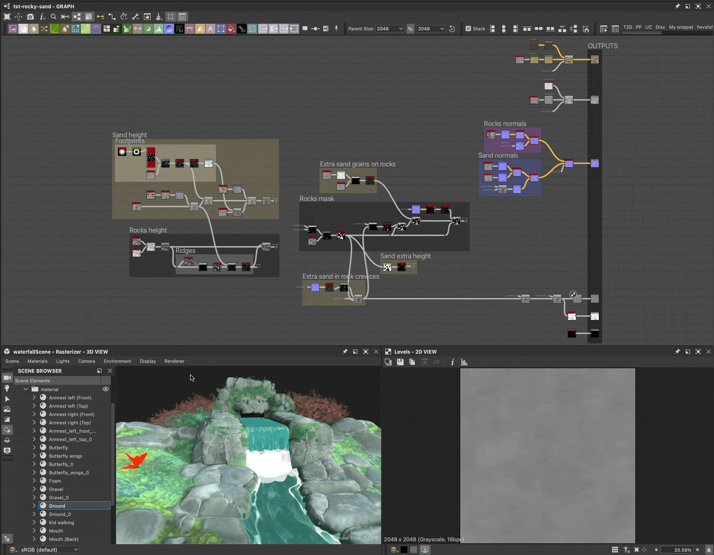

# Remplacement des matériaux de scène

Lorsque vous travaillez sur des scènes 3D avec des matériaux existants, il est nécessaire de remplacer ces matériaux afin de les remplacer par les vôtres.

Votre matière peut être créée à partir de zéro ou une version ajustée de la matière d&#39;une scène qui a été [extraite dans un graphique de Substance](../../working-with-3d-scenes/extracting-materials-val/extracting-materials-values-and-textures.md).

{zoomable="yes"}

<table>
<tr style="border: 0;">
<td style="border: 0;" valign="top">

## Remplacer la matière de la scène

</td>
<td style="border: 0;" valign="top">

### Rétablir l’état de la scène

</td>
<td style="border: 0;" valign="top">

### Matériau connecté

</td>
</tr>
</table>

## Remplacer la matière de la scène

Tout matériau utilisé dans une scène peut être remplacé par votre propre version, qu’il s’agisse d’un nouveau matériau ou d’une version modifiée du matériau existant.

L’action « Remplacer la matière » se trouve à deux endroits :

* Ouvrez le menu « Matières » et accédez au sous-menu de la matière souhaitée
* Appuyez sur Maj + LMB sur un objet scène pour le sélectionner, puis cliquez sur RMB pour ouvrir son menu contextuel

<table>
<tr style="border: 0;">
<td style="border: 0;" valign="top">

{zoomable="yes"}

*Action dans la fenêtre d’affichage de la vue 3D*

</td>
<td style="border: 0;" valign="top">

{zoomable="yes"}

*Action dans le menu Matières*

</td>
</tr>
</table>

Dans le cadre de Designer, qui utilise USD pour la description interne de la scène, le remplacement signifie *créer une copie* du matériau qui correspond le plus possible à l&#39;original et modifier la *liaison du matériau* des maillages de la scène de l&#39;original à la copie.

>[!NOTE]
>
> Les copies sont créées dans la scène dans un dossier « <b>matériau</b> » (« Scope » en USD) sous la racine et utilisent le même identifiant que l’original plus un suffixe numérique (par exemple : « rustedMetal\_0 »)

Cela signifie deux choses importantes :

1. Le matériel original n&#39;est jamais modifié d&#39;aucune façon.
1. Tout travail effectué dans Designer sera appliqué à la copie.

Vous pouvez activer et désactiver n’importe quel remplacement à n’importe quel moment via la même action « Remplacer le matériau » si vous souhaitez restaurer le matériau de la scène d’origine ou effectuer une vérification rapide avant-après au fur et à mesure

Etant donné que la copie a été créée pour correspondre à l’original, le remplacement d’un matériau ne doit pas modifier son apparence dans la plupart des cas (voir la note ci-dessous), tant que vous n’avez pas connecté un graphique en Substance à ce dernier ou modifié ses propriétés.

>[!NOTE]
>
> Lorsqu’un format personnalisé est appliqué, Designer calcule les tangentes et les normales des maillages concernés, ce qui peut prendre un certain temps et modifier l’aspect de ces maillages, en particulier s’ils n’ont pas d’échelle normale ni de biais définis, ou s’ils en utilisent d’autres.

>[!IMPORTANT]
>
> Le modèle d&#39;ombrage <b>AdobeStandardMaterial</b> est pris en charge dans l&#39;écosystème Substance 3D, mais il ne s&#39;agit pas d&#39;une norme sectorielle et par conséquent, *peut ne pas être pris en charge* par les applications tierces, telles que Blender.
> 
> Pour une interopérabilité optimale en dehors des applications Substance 3D, il est actuellement recommandé d&#39;utiliser le modèle d&#39;ombrage <b>UsdPreviewSurface</b>, même s&#39;il prend en charge beaucoup moins de propriétés et d&#39;effets de matériau.

## Rétablir l’état de la scène

Si vous devez revenir à l’état initial d’un matériau, tout en conservant sa remplacement et en pouvant toujours le modifier, vous pouvez réinitialiser les valeurs initiales de toute copie de matériau.

Si une valeur de propriété de matériau a été modifiée ou si une texture d&#39;un graphique lui a été appliquée, la propriété revient à sa valeur ou texture initiale.

Un matériau peut être réinitialisé entièrement ou par propriété.

Utilisez l’action Réinitialiser la matière à l’état de la scène dans le sous-menu de la matière ou le menu contextuel d’un filet pour réinitialiser entièrement la matière.

L’action se trouve à trois endroits :

* Ouvrez le menu « Matières » et accédez au sous-menu de la matière souhaitée
* Appuyez sur Maj + LMB sur un objet scène pour le sélectionner, puis cliquez sur RMB pour ouvrir son menu contextuel
* Menu hamburger en haut des propriétés de ce matériau

<table>
<tr style="border: 0;">
<td style="border: 0;" valign="top">

{zoomable="yes"}

*Action dans la fenêtre d’affichage de la vue 3D*

</td>
<td style="border: 0;" valign="top">

{zoomable="yes"}

*Action dans le menu Matières*

</td>
<td style="border: 0;" valign="top">

{zoomable="yes"}

*Action dans les propriétés du matériau*

</td>
</tr>
</table>

<table>
<tr style="border: 0;">
<td style="border: 0;" valign="top">

L&#39;action est également disponible *par propriété* dans les propriétés du matériau, au cas où vous voudriez réinitialiser uniquement certains aspects d&#39;un matériau.

Ouvrez le menu hamburger de la propriété Matériau pour rechercher l’action « Rétablir l’état de scène par défaut ».

</td>
<td style="border: 0;" valign="top">

{zoomable="yes"}

</td>
</tr>
</table>

## Matériau connecté

Encore une fois, Designer ne modifie pas directement la matière d’une scène. Il crée une copie de la scène et lie les filets à cette copie au lieu de l’original.

D&#39;autre part, Designer a *sa propre liste* de matériaux dans son menu « Matériaux » qui correspond par défaut à la liste des matériaux de la scène. Vous pouvez ajouter de nouveaux matériaux à cette liste à tout moment.

Il s&#39;agit d&#39;un ensemble de données *différent* qui est créé et géré uniquement dans Designer. Ces matériaux sont ensuite *connectés aux copies* qui remplacent les matériaux d&#39;origine de la scène.

{zoomable="yes"}

Vous pouvez connecter l’une des matières répertoriées dans le menu « Matières » aux copies créées par Designer dans la scène : cliquez sur RMB sur une copie dans le navigateur de la scène et accédez au sous-menu « Connecter la matière ».

Le sous-menu répertorie toutes les matières de la scène, ainsi que toutes les matières que vous avez créées manuellement à partir du menu « Matières ».

{zoomable="yes"}
