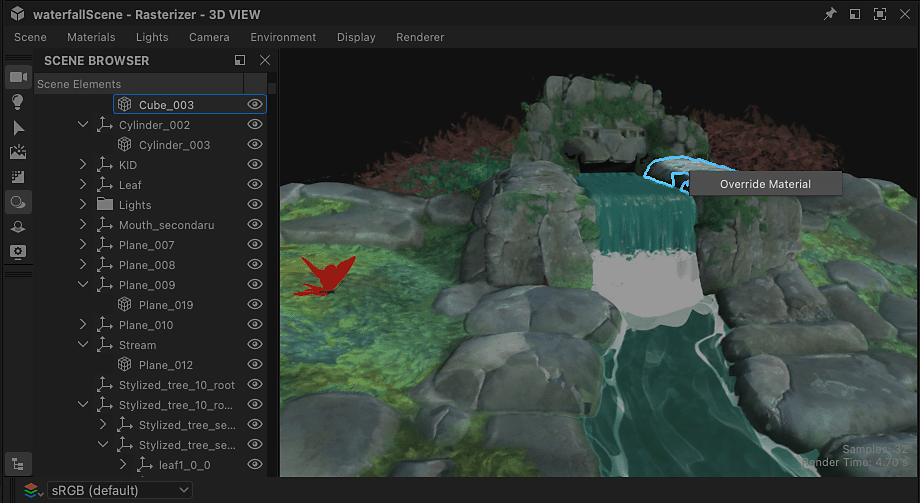

# Remplacement des matériaux de scène

Lorsque vous utilisez des scènes 3D avec des matériaux existants, il est nécessaire de remplacer ces matériaux afin de les remplacer par les vôtres.

Votre matériau peut être créé à partir de zéro ou une version ajustée du matériau d&#39;une scène [extraite dans un graphe de Substance](../../working-with-3d-scenes/extracting-materials-val/extracting-materials-values-and-textures.md).

{zoomable="yes"}

<table>
<tr style="border: 0;">
<td style="border: 0;" valign="top">

## Remplacer le matériau de scène

</td>
<td style="border: 0;" valign="top">

### Rétablir l’état de scène

</td>
<td style="border: 0;" valign="top">

### Matériau connecté

</td>
</tr>
</table>

## Remplacer le matériau de scène

Tout matériau utilisé dans une scène peut être remplacé par votre propre version, c’est-à-dire un nouveau matériau ou une version modifiée du matériau existant.

L’action « Remplacer le matériau » se trouve à deux endroits :

* Ouvrez le menu Matériaux et accédez au sous-menu du matériau souhaité
* Appuyez sur Maj + LMB sur un objet des scènes pour le sélectionner, puis cliquez sur RMB pour ouvrir son menu contextuel

<table>
<tr style="border: 0;">
<td style="border: 0;" valign="top">

{zoomable="yes"}

*Action dans le viewport vue 3D*

</td>
<td style="border: 0;" valign="top">

{zoomable="yes"}

*Action dans le menu Matériaux*

</td>
</tr>
</table>

Dans Designer, qui utilise USD pour sa description de scène interne, le remplacement signifie la *création d&#39;une copie* du matériau qui correspond le plus possible à l&#39;original et la modification de la *liaison de matériau* des maillages de la scène de l&#39;original vers la copie.

>[!NOTE]
>
> Les copies sont créées dans la scène de données dans un dossier « <b>matériau</b> » (« Scope » dans USD) sous la racine et utilisent le même identifiant que l’original plus un suffixe numérique (par exemple : « rustedMetal\_0 »)

Cela signifie deux choses importantes :

1. Le matériau d&#39;origine n&#39;est en aucun cas modifié.
1. Tout travail effectué dans Designer sera appliqué à la copie.

Vous pouvez activer et désactiver n’importe quel remplacement à tout moment via la même action « Remplacer le matériau », si vous souhaitez restaurer le matériau de la scène d’origine ou effectuer une vérification rapide avant-après au fur et à mesure

Etant donné que la copie a été créée pour correspondre à l’original, le remplacement d’un matériau ne doit pas modifier son apparence dans la plupart des cas (voir la remarque ci-dessous), tant que vous n’avez pas connecté un graphe de Substance à celui-ci ou modifié ses propriétés.

>[!NOTE]
>
> Lors de l’application d’un remplacement, Designer calcule les tangentes et les normes binaires des maillages concernés, ce qui peut prendre un certain temps et modifier l’aspect de ces maillages, en particulier si ces maillages n’ont pas d’échelle ni de biais normaux définis ou s’ils en utilisent d’autres.

>[!IMPORTANT]
>
> Le modèle d&#39;ombrage <b>AdobeStandardMaterial</b> est pris en charge dans l&#39;écosystème Substance 3D, mais il ne s&#39;agit pas d&#39;une norme sectorielle et par conséquent, *peut ne pas être pris en charge* par les applications tierces, telles que Blender.
> 
> Pour une interopérabilité optimale en dehors des applications Substance 3D, il est actuellement recommandé d&#39;utiliser le modèle d&#39;ombrage <b>UsdPreviewSurface</b>, même s&#39;il prend en charge beaucoup moins de propriétés et d&#39;effets de matériau.

## Rétablir l’état de scène

Si vous devez revenir à l’état initial d’un matériau, tout en conservant son remplacement et en pouvant toujours le modifier, vous pouvez réinitialiser les valeurs initiales de n’importe quelle copie de matériau.

Si une valeur de propriété de matériau a été modifiée ou si une texture d&#39;un graphe lui a été appliquée, la propriété est rétablie à sa valeur ou texture initiale.

Un matériau peut être réinitialisé entièrement ou par propriété.

Utilisez l’action Réinitialiser le matériau à l’état de scène dans le sous-menu du matériau ou dans le menu contextuel d’un maillage pour réinitialiser entièrement le matériau.

L’action se trouve à trois endroits :

* Ouvrez le menu Matériaux et accédez au sous-menu du matériau souhaité
* Appuyez sur Maj + LMB sur un objet des scènes pour le sélectionner, puis cliquez sur RMB pour ouvrir son menu contextuel
* Le menu hamburger en haut des propriétés de ce matériau

<table>
<tr style="border: 0;">
<td style="border: 0;" valign="top">

{zoomable="yes"}

*Action dans le viewport vue 3D*

</td>
<td style="border: 0;" valign="top">

{zoomable="yes"}

*Action dans le menu Matériaux*

</td>
<td style="border: 0;" valign="top">

{zoomable="yes"}

*Action dans les propriétés du matériau*

</td>
</tr>
</table>

<table>
<tr style="border: 0;">
<td style="border: 0;" valign="top">

L&#39;action est également disponible *par propriété* dans les propriétés du matériau, au cas où vous voudriez réinitialiser uniquement certains aspects d&#39;un matériau.

Ouvrez le menu hamburger de la propriété matériau pour rechercher l’action « Rétablir l’état de scène par défaut ».

</td>
<td style="border: 0;" valign="top">

{zoomable="yes"}

</td>
</tr>
</table>

## Matériau connecté

Encore une fois : Designer ne modifie pas directement le matériau d’une scène. Il crée une copie dans la scène et lie les maillages à cette copie au lieu de l’original.

D&#39;autre part, Designer a *sa propre* liste de matériaux dans son menu « Matériaux » qui correspond par défaut à la liste des matériaux de la scène. Vous pouvez ajouter de nouveaux matériaux à cette liste à tout moment.

Il s&#39;agit d&#39;un ensemble de données *différent* qui est créé et géré uniquement dans Designer. Ces matériaux sont ensuite *connectés aux copies* qui remplacent les matériaux d&#39;origine de la scène.

{zoomable="yes"}

Vous pouvez connecter l’un des matériaux répertoriés dans le menu « Matériaux » aux copies créées par Designer dans la scène de données : cliquez sur RMB sur une copie dans le navigateur de Scènes de données et accédez au sous-menu « Connecter un matériau ».

Le sous-menu répertorie tous les matériaux de la scène et tous les matériaux que vous avez créés manuellement à partir du menu Matériaux.

{zoomable="yes"}
