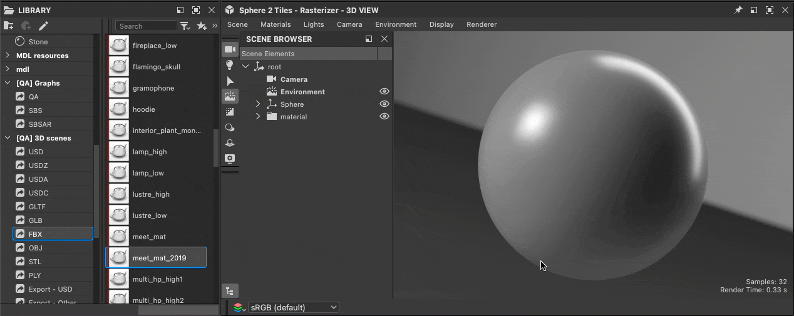

# Utilisation des scènes 3D

{zoomable="yes"}

Designer vous permet de charger des [scènes 3D](../glossary/glossary.md) pour travailler sur des matériaux en contexte. Vous trouverez ici une liste des formats de fichiers pris en charge pour les scènes 3D, y compris une liste des fonctions prises en charge pour chaque format. <b>&lt;link required></b>

Travailler en contexte implique de [remplacer](../working-with-3d-scenes/overriding-scene-mat/overriding-scene-materials.md) l&#39;un des [matériaux](../glossary/glossary.md) de la scène pour la remplacer par un matériau créé dans Designer.\
Vous pouvez partir de zéro en utilisant l&#39;un des modèles de graphe de Substance disponibles dans Designer ou [extraire des valeurs et des textures](../working-with-3d-scenes/extracting-materials-val/extracting-materials-values-and-textures.md) du matériau de Scène 3D comme point de départ.

Lorsque vous avez terminé avec Scène 3D, vous pouvez [l&#39;exporter](../working-with-3d-scenes/exporting-scenes/exporting-scenes.md) vers un nouveau fichier à assimiler dans une autre application.

Lors de l&#39;exportation aux formats USD, ce workflow peut être entièrement <b>non destructif</b>, ce qui signifie que seules les modifications et les ajouts sont exportés.

Tout d’abord, vous devez charger une Scène 3D sur laquelle travailler et être en mesure de conserver son état dans Designer entre les sessions.

<table>
<tr style="border: 0;">
<td style="border: 0;" valign="top">

## Contenu des scènes 3D

</td>
<td style="border: 0;" valign="top">

### Chargement d’une scène

</td>
<td style="border: 0;" valign="top">

### fichiers d’état de scène

</td>
</tr>
</table>

## Contenu des scènes 3D

Lors du chargement d’une Scène 3D, Designer a créé sa propre scène pour l’héberger.

Vous pouvez interagir avec les contenus suivants de la scène :

* <b>Matériaux :</b> tous les matériaux utilisés dans la scène peuvent être [remplacés](../working-with-3d-scenes/overriding-scene-mat/overriding-scene-materials.md) par une copie créée par Designer. Vous pouvez modifier les [propriétés de matériau](../interface/3d-view/material-properties/material-properties.md) de cette copie, avec des valeurs brutes ou des textures d&#39;un graphe de Substance.
* <b>Maillages :</b> la géométrie peut être sélectionnée directement dans le viewport ou dans l&#39;[explorateur de Scènes](../interface/3d-view/scene-browser/scene-browser.md), pour accéder à ses actions de matériau ([remplacement](../working-with-3d-scenes/overriding-scene-mat/overriding-scene-materials.md), [réinitialisation](../working-with-3d-scenes/overriding-scene-mat/overriding-scene-materials.md), [extraction vers le graphe de Substances](../working-with-3d-scenes/extracting-materials-val/extracting-materials-values-and-textures.md))
* <b>Éclairages :</b> tous les éclairages de la scène peuvent être désactivés dans le [navigateur de Scènes](../interface/3d-view/scene-browser/scene-browser.md).
* <b>Caméras :</b> toute caméra détectée dans la scène est ajoutée en tant que paramètre prédéfini à la caméra ajoutée par Designer.

{zoomable="yes"}

Designer utilise une description USD pour sa Scène 3D. Sa disposition peut être parcourue dans l&#39;explorateur de Scènes, où chaque type [USD prim](https://openusd.org/release/glossary.html#usdglossary-prim) a sa propre icône (géométrie, matériau, shader, caméra, transforme, ...).

L&#39;[Explorateur de Scènes](../interface/3d-view/scene-browser/scene-browser.md) peut être utilisé pour sélectionner, activer et désactiver le contenu de la scène. Par conséquent, nous vous recommandons de le conserver affiché lorsque vous travaillez avec des scènes 3D personnalisées.

## Chargement d’une scène

Il existe plusieurs chemins pour charger une Scène 3D dans la vue 3D :

1. Double-cliquez ou faites glisser une [ressource Scène 3D](../resources/3d-scene-resource/3d-scene-resource.md) d&#39;un [package](../glossary/glossary.md) dans vue 3D
1. Faites glisser un élément Scène 3D de la [bibliothèque](../interface/the-library/the-library.md) dans la vue 3D (à condition que [vous ayez ajouté votre propre contenu à la bibliothèque](../interface/the-library/managing-custom-content/managing-custom-content-and-filters.md))
1. Faites glisser un fichier Scène 3D du navigateur de fichiers du système dans le vue 3D
1. Charger un fichier d&#39;état Scène 3D (SBSSCN) avec son maillage référencé

Notez que seules les méthodes 1 et 4 vous permettent de charger à nouveau la scène exactement telle qu&#39;elle était la dernière fois que vous avez travaillé dessus, car l&#39;état de la scène est écrit dans le fichier d&#39;état de scène et de ressource Scène 3D et enregistré dans le package. Les méthodes 2 et 3 permettent de charger la scène comme toute autre.

<table>
<tr style="border: 0;">
<td style="border: 0;" valign="top">

{zoomable="yes"}

Chargement d&#39;une ressource Scène 3D

</td>
<td style="border: 0;" valign="top">

{zoomable="yes"}

Chargement d&#39;une Scène 3D à partir de la bibliothèque

</td>
</tr>
</table>

<table>
<tr style="border: 0;">
<td style="border: 0;" valign="top">

{zoomable="yes"}

Chargement d’un fichier Scène 3D

</td>
<td style="border: 0;" valign="top">

{zoomable="yes"}

Chargement d’un fichier d’état de scène

</td>
</tr>
</table>

>[!NOTE]
>
> La navigation et la visualisation de la scène dans la vue 3D sont traitées dans la [documentation vue 3D](../interface/3d-view/3d-view.md).

<table>
<tr style="border: 0;">
<td width="100.00%" style="border: 0;" valign="top">

Designer crée toujours son propre environnement (DomeLight dans USD) et sa propre caméra en plus de ceux qui peuvent exister dans la scène.

Tous les éléments créés par Designer sont répertoriés avec des <b>étiquettes en gras</b> dans l&#39;explorateur de Scènes.

>[!NOTE]
>
> Lorsqu&#39;une scène chargée comporte au moins un environnement (DomeLight), l&#39;environnement créé par Designer est *désactivé par défaut* afin de ne pas interférer avec l&#39;éclairage de l&#39;environnement de la scène.

</td>
<td width="33.33%" style="border: 0;" valign="top">

{zoomable="yes"}

</td>
</tr>
</table>

## fichiers d’état de scène

Après avoir configuré un matériau, une caméra, des lumières, etc. dans vue 3D, cet état peut être enregistré dans un fichier d&#39;état de scène (.sbsscn) qui peut être chargé ultérieurement pour restaurer cet état. Par exemple, vous pouvez définir quelques scènes pour prévisualiser différents types de matériaux ou un environnement d’éclairage spécifique.

{zoomable="yes"}

Un état de scène enregistré peut également être utilisé comme état par défaut pour la vue 3D, de sorte que chaque fois qu&#39;une nouvelle vue 3D est créée, cet état est utilisé. Ceci est utile si vous voulez prévisualiser les matériaux de vos matériaux par défaut sur le maillage Sphère 2-Mosaïques avec une valeur de répétition de 2 et une map d&#39;environnement spécifique.

Les actions liées aux fichiers d&#39;état de scène se trouvent dans le menu Scène de vue 3D et sont documentées [ici](../interface/3d-view/3d-view.md).

Les fichiers d&#39;état de scène de données utilisent le format XML et utilisent [des alias](../pipeline-and-project-con/project-configuration-fil/project-configuration-files-sbsprj.md), le cas échéant, définis dans les [paramètres du projet](../interface/preferences-window/project-settings/project-settings.md).

>[!NOTE]
>
> Le moteur de rendu n’est pas enregistré dans le fichier d’état de scène.
